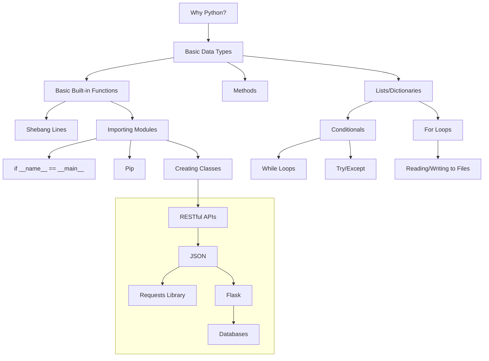

```mermaid
graph TD
    A[Why Python?] --> B[Basic Data Types]
    B --> C[Basic Built-in Functions]
    C --> D[Shebang Lines]
    B --> E[Methods]
    B --> F[Lists/Dictionaries]
    F --> G[Conditionals]
    G --> H[While Loops]
    G --> I[Try/Except]
    C --> J[Importing Modules]
    J --> K[if __name__ == __main__]
    F --> L[For Loops]
    L --> M[Reading/Writing to Files]
    J --> N[Pip]
    J --> O[Creating Classes]
    
    %% Start of the subgraph for RESTful APIs and below
    subgraph Rest_APIs_Box [ ]
      P[RESTful APIs]
      P --> Q[JSON]
      Q --> R[Requests Library]
      Q --> S[Flask]
      S --> T[Databases]
    end

    O --> P
```
