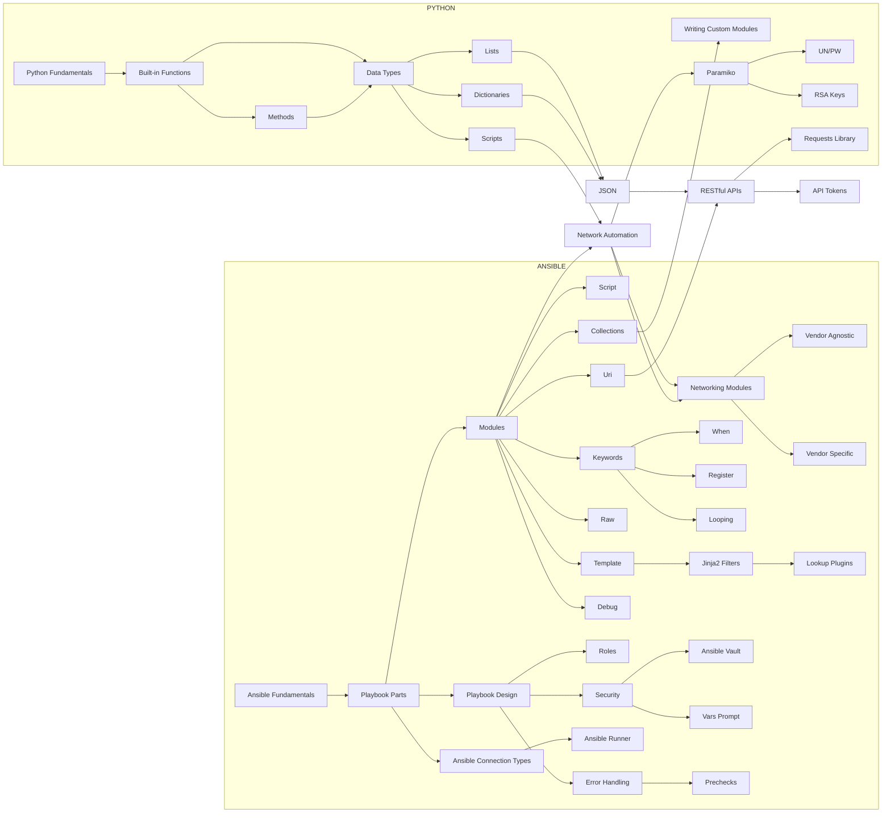

# Network Automation with Python and Ansible (NAPYA)
### Course Content Flowchart

```mermaid
flowchart LR
    RAPI[RESTful APIs]
    AT[API Tokens]
    NA[Network Automation]
    
    RAPI --> AT
    
    subgraph s1["PYTHON"]
        direction LR
        classDef title fill:#ffffff,stroke:none,font-size:18px,align:left;
        class s1 title;
        
        WC["Writing Custom Modules"]
        UNPW["UN/PW"]
        RSA["RSA Keys"]
        PM["Paramiko"]
        M["Methods"]
        RL["Requests Library"]
        D["Dictionaries"]
        L["Lists"]
        DT["Data Types"]
        BIF["Built-in Functions"]
        PF["Python Fundamentals"]
        S["Scripts"]
    end
    
    PF --> BIF
    BIF --> M
    BIF --> DT
    DT --> L
    DT --> D
    DT --> S
    M --> DT
    L --> JSON
    D --> JSON
    JSON --> RAPI
    RAPI --> RL
    NA --> PM
    PM --> RSA
    PM --> UNPW
    NA --> NM
    S --> NA
    
    subgraph s2["ANSIBLE"]
        direction LR
        classDef title fill:#ffffff,stroke:none,font-size:18px,align:left;
        class s2 title;

        VA["Vendor Agnostic"]
        VS["Vendor Specific"]
        NM["Networking Modules"]
        Scr["Script"]
        Cl["Collections"]
        Wh["When"]
        Reg["Register"]
        Lp["Looping"]
        KW["Keywords"]
        LP["Lookup Plugins"]
        JF["Jinja2 Filters"]
        Tpl["Template"]
        Raw
        Uri
        Dbg["Debug"]
        AV["Ansible Vault"]
        VP["Vars Prompt"]
        R["Roles"]
        Sec["Security"]
        AR["Ansible Runner"]
        PC["Prechecks"]
        EH["Error Handling"]
        PD["Playbook Design"]
        ACT["Ansible Connection Types"]
        MOD["Modules"]
        PP["Playbook Parts"]
        AF["Ansible Fundamentals"]
    end
    
    AF --> PP
    PP --> MOD
    MOD --> Dbg
    MOD --> Uri
    Uri --> RAPI
    MOD --> Raw
    MOD --> Tpl
    Tpl --> JF
    JF --> LP
    MOD --> KW
    KW --> Lp
    KW --> Reg
    KW --> Wh
    MOD --> Cl
    Cl --> WC
    MOD --> Scr
    MOD --> NA
    NA --> NM
    NM --> VS
    NM --> VA
    PP --> ACT
    ACT --> AR
    PP --> PD
    PD --> EH
    EH --> PC
    PD --> Sec
    Sec --> VP
    Sec --> AV
    PD --> R

```
