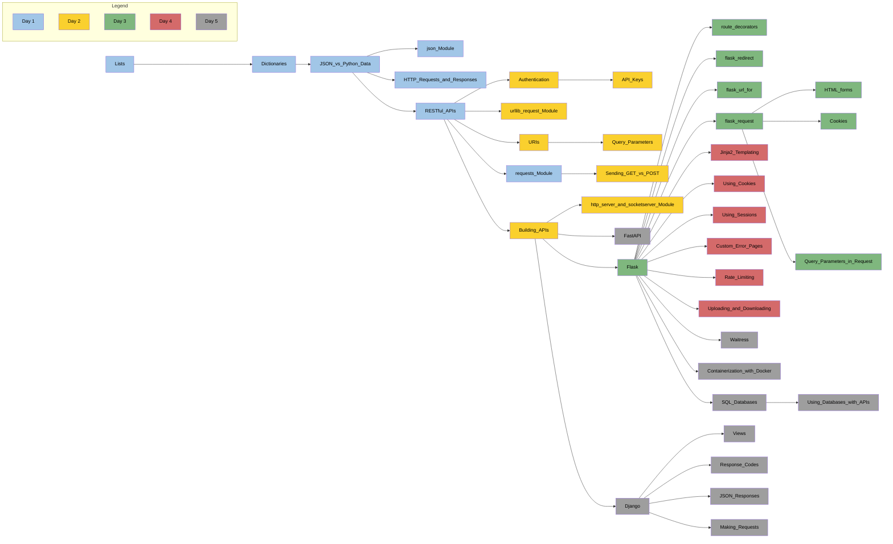

# APIs and API Design with Python

```mermaid
flowchart LR
    %% Main Path from Lists to Dictionaries to JSON vs Python Data to json Module
    Lists --> Dictionaries
    Dictionaries --> JSON_vs_Python_Data
    JSON_vs_Python_Data --> json_Module
    JSON_vs_Python_Data --> HTTP_Requests_and_Responses
    JSON_vs_Python_Data --> RESTful_APIs
    
    %% RESTful API leads to other topics
    RESTful_APIs --> requests_Module
    RESTful_APIs --> urllib_request_Module
    RESTful_APIs --> Authentication
    RESTful_APIs --> URIs
    
    %% Branches from Authentication
    Authentication --> API_Keys
    
    %% Branches from URIs
    URIs --> Query_Parameters
    
    %% Branch from requests_Module
    requests_Module --> Sending_GET_vs_POST
    
    %% Branch from RESTful_APIs to Building APIs and its sub-topics
    RESTful_APIs --> Building_APIs
    Building_APIs --> http_server_and_socketserver_Module
    Building_APIs --> FastAPI
    Building_APIs --> Django
    Building_APIs --> Flask
    
    %% Flask and its subtopics
    Flask --> route_decorators
    Flask --> flask_redirect
    Flask --> flask_url_for
    Flask --> flask_request
    flask_request --> HTML_forms
    flask_request --> Cookies
    flask_request --> Query_Parameters_in_Request
    Flask --> Jinja2_Templating
    Flask --> Using_Cookies
    Flask --> Using_Sessions
    Flask --> Custom_Error_Pages
    Flask --> Rate_Limiting
    Flask --> Uploading_and_Downloading
    Flask --> Waitress
    Flask --> Containerization_with_Docker
    Flask --> SQL_Databases
    SQL_Databases --> Using_Databases_with_APIs
    
    %% Django and its subtopics
    Django --> Views
    Django --> Response_Codes
    Django --> JSON_Responses
    Django --> Making_Requests
    
    %% Legend with colored boxes
    subgraph Legend [Legend]
        Day1[Day 1] 
        Day2[Day 2]
        Day3[Day 3]
        Day4[Day 4]
        Day5[Day 5]
    end

    %% Style for legend colors
    style Day1 fill:#A1C6E7,color:black
    style Day2 fill:#FAD02E,color:black
    style Day3 fill:#7FB77E,color:black
    style Day4 fill:#D46A6A,color:black
    style Day5 fill:#9E9E9E,color:black

    %% Style for each day
    %% Day 1 - #A1C6E7
    style Lists fill:#A1C6E7,color:black
    style Dictionaries fill:#A1C6E7,color:black
    style JSON_vs_Python_Data fill:#A1C6E7,color:black
    style json_Module fill:#A1C6E7,color:black
    style RESTful_APIs fill:#A1C6E7,color:black
    style requests_Module fill:#A1C6E7,color:black
    style HTTP_Requests_and_Responses fill:#A1C6E7,color:black

    %% Day 2 - #FAD02E
    style urllib_request_Module fill:#FAD02E,color:black
    style Authentication fill:#FAD02E,color:black
    style URIs fill:#FAD02E,color:black
    style Query_Parameters fill:#FAD02E,color:black
    style Sending_GET_vs_POST fill:#FAD02E,color:black
    style Building_APIs fill:#FAD02E,color:black
    style http_server_and_socketserver_Module fill:#FAD02E,color:black
    style API_Keys fill:#FAD02E,color:black

    %% Day 3 - #7FB77E
    style Flask fill:#7FB77E,color:black
    style route_decorators fill:#7FB77E,color:black
    style flask_redirect fill:#7FB77E,color:black
    style flask_url_for fill:#7FB77E,color:black
    style flask_request fill:#7FB77E,color:black
    style HTML_forms fill:#7FB77E,color:black
    style Cookies fill:#7FB77E,color:black
    style Query_Parameters_in_Request fill:#7FB77E,color:black

    %% Day 4 - #D46A6A
    style Jinja2_Templating fill:#D46A6A,color:black
    style Using_Cookies fill:#D46A6A,color:black
    style Using_Sessions fill:#D46A6A,color:black
    style Custom_Error_Pages fill:#D46A6A,color:black
    style Rate_Limiting fill:#D46A6A,color:black
    style Uploading_and_Downloading fill:#D46A6A,color:black

    %% Day 5 - #9E9E9E
    style Waitress fill:#9E9E9E,color:black
    style Containerization_with_Docker fill:#9E9E9E,color:black
    style SQL_Databases fill:#9E9E9E,color:black
    style Using_Databases_with_APIs fill:#9E9E9E,color:black
    style Django fill:#9E9E9E,color:black
    style Views fill:#9E9E9E,color:black
    style Response_Codes fill:#9E9E9E,color:black
    style JSON_Responses fill:#9E9E9E,color:black
    style Making_Requests fill:#9E9E9E,color:black
    style FastAPI fill:#9E9E9E,color:black
```
